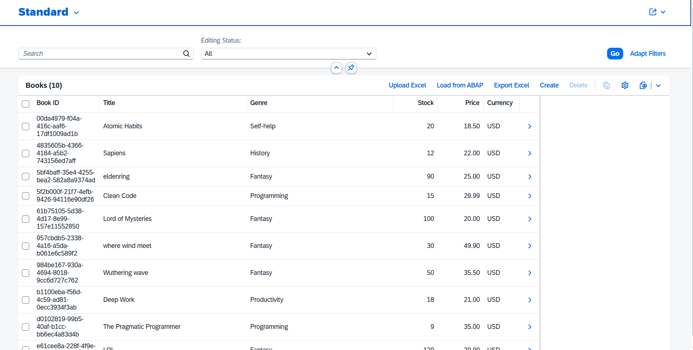
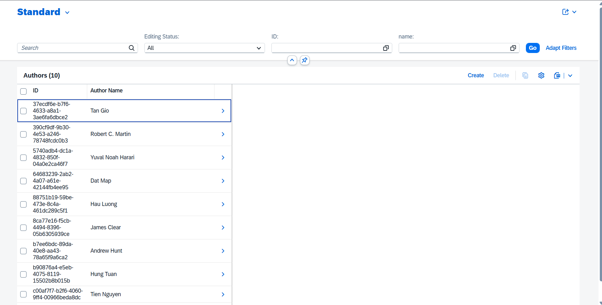
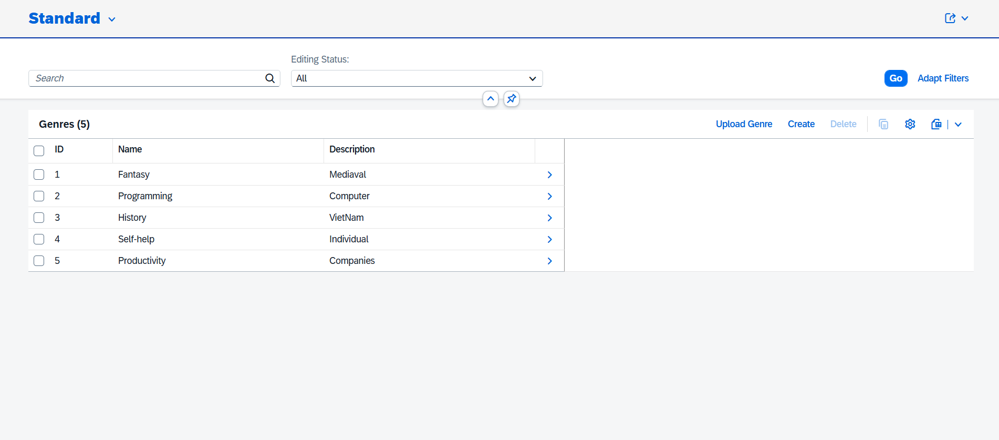
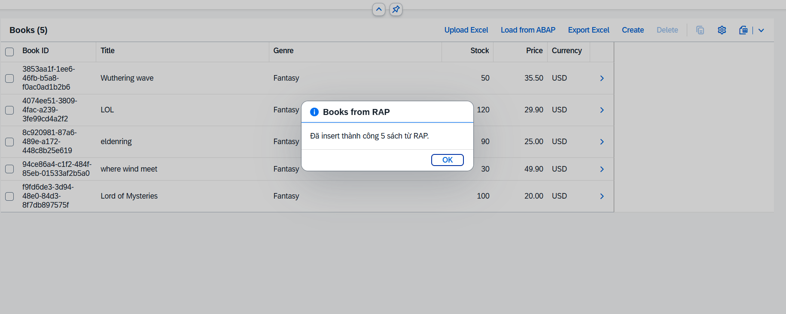
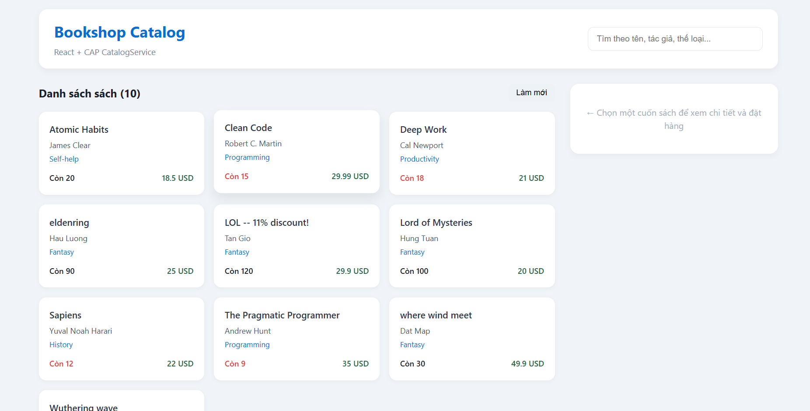
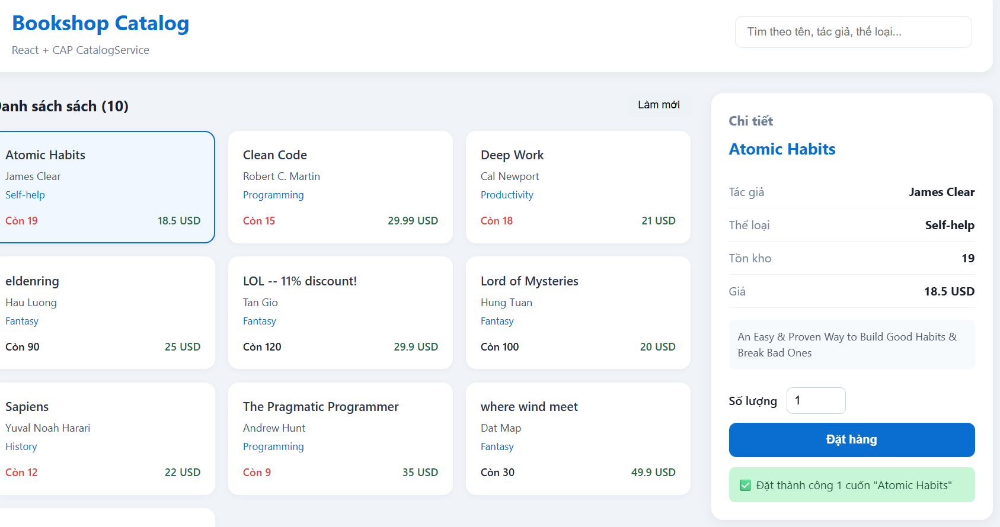
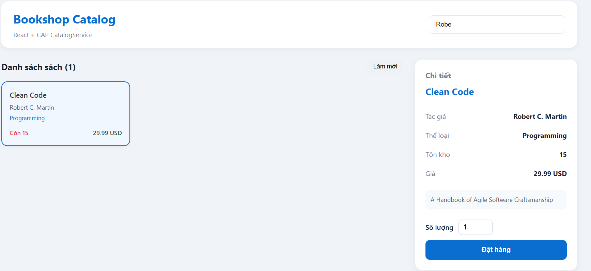

# Bookshop — SAP CAP Full-Stack Project

Ứng dụng quản lý cửa hàng sách xây dựng trên **SAP Cloud Application Programming Model (CAP)**, kết hợp backend OData V4, tích hợp **SAP S/4HANA RAP**, và nhiều giao diện frontend (Fiori Elements + React).

---

## Mục lục

- [Tổng quan](#tổng-quan)
- [Ảnh demo](#ảnh-demo)
- [Tính năng chính](#tính-năng-chính)
- [Kiến trúc hệ thống](#kiến-trúc-hệ-thống)
- [Cấu trúc thư mục](#cấu-trúc-thư-mục)
- [Mô hình dữ liệu](#mô-hình-dữ-liệu)
- [Các service API](#các-service-api)
- [Ứng dụng frontend](#ứng-dụng-frontend)
- [Yêu cầu hệ thống](#yêu-cầu-hệ-thống)
- [Cài đặt & chạy dự án](#cài-đặt--chạy-dự-án)
- [Cấu hình kết nối S/4HANA](#cấu-hình-kết-nối-s4hana)
- [Định dạng file Excel](#định-dạng-file-excel)
- [Kiểm thử API](#kiểm-thử-api)
- [Scripts hữu ích](#scripts-hữu-ích)
- [Lưu ý bảo mật](#lưu-ý-bảo-mật)
- [Công nghệ sử dụng](#công-nghệ-sử-dụng)

---

## Tổng quan

Dự án mô phỏng một hệ thống **Bookshop** với hai vai trò chính:

| Vai trò | Mô tả | Giao diện |
|--------|--------|-----------|
| **Admin** | Quản lý sách, tác giả, thể loại; import/export Excel; đồng bộ dữ liệu từ SAP RAP | Fiori Elements (`adminserviceui`) |
| **Khách hàng** | Xem catalog, tìm kiếm, đặt hàng (trừ tồn kho) | React (`catalog`) hoặc Fiori Elements (`project1`) |

Backend sử dụng **SQLite** cho môi trường phát triển local, có thể mở rộng sang SAP HANA hoặc PostgreSQL khi triển khai production.

---

## Ảnh demo

> Thêm ảnh chụp màn hình vào thư mục [`docs/images/`](docs/images/) và cập nhật đường dẫn bên dưới trước khi push lên Git.

### Admin UI — Quản lý sách


*Màn hình List Report quản lý Books với các nút Upload Excel, Load from ABAP, Export Excel.*


*Màn hình List Report quản lý Books với các nút Upload Excel, Load from ABAP, Export Excel.*


*Màn hình List Report quản lý Books với các nút Upload Excel, Load from ABAP, Export Excel.*


*Đồng bộ sách từ SAP S/4HANA RAP (ZUI_BOOK).*

### Catalog — Giao diện khách hàng (React)


*Trang catalog React: tìm kiếm, xem chi tiết và đặt hàng.*


*Form đặt hàng với cập nhật tồn kho realtime.*

### Fiori Elements — Browse Books


*Ứng dụng Fiori Elements đọc dữ liệu từ CatalogService.*


## Tính năng chính

### Quản trị (AdminService)

- **CRUD** đầy đủ cho `Authors`, `Books`, `Genres` (hỗ trợ OData Draft).
- **Upload sách từ Excel** — import hàng loạt, tự tạo tác giả mới nếu chưa tồn tại.
- **Upload thể loại từ Excel** — insert thể loại mới hoặc cập nhật mô tả nếu trùng tên.
- **Export sách ra Excel** — export các dòng đang chọn hoặc đang hiển thị trên bảng.
- **Load from ABAP (RAP)** — lấy sách từ OData service `ZUI_BOOK` trên SAP S/4HANA Cloud và insert vào database CAP.
- **Ràng buộc dữ liệu**: giá từ 1–111, tồn kho ≥ 0, bắt buộc chọn author và genre hợp lệ.

### Catalog (CatalogService)

- **Đọc danh sách sách** (readonly) kèm tên tác giả và thể loại.
- **Giảm giá tự động**: sách có `stock > 111` được thêm hậu tố `-- 11% discount!` vào tiêu đề.
- **Đặt hàng** (`submitOrder`): trừ tồn kho, báo lỗi 409 nếu không đủ hàng.

### Tích hợp bên ngoài

- Kết nối **SAP S/4HANA Cloud** qua OData V4 service `ZUI_BOOK` (RAP backend).
- Sử dụng thư viện **xlsx** cho import/export Excel.

---

## Kiến trúc hệ thống

```
┌─────────────────────────────────────────────────────────────────┐
│                        Frontend Layer                           │
├──────────────────┬────────────────────┬─────────────────────────┤
│  adminserviceui  │     project1       │       catalog           │
│  (Fiori Elements)│  (Fiori Elements)  │   (React + Vite)        │
│  Admin CRUD      │  Browse Books      │   Storefront + Order    │
└────────┬─────────┴─────────┬──────────┴───────────┬─────────────┘
         │                   │                      │
         ▼                   ▼                      ▼
┌─────────────────────────────────────────────────────────────────┐
│                     CAP Backend (Node.js)                       │
├──────────────┬──────────────┬──────────────┬──────────────────────┤
│ AdminService │CatalogService│ExportService│   UploadService     │
│   /admin     │   /browse    │   /export    │     /upload         │
└──────┬───────┴──────┬───────┴──────┬───────┴──────────┬─────────┘
       │              │              │                  │
       ▼              ▼              │                  │
┌──────────────┐ ┌──────────────┐     │                  │
│   SQLite     │ │   SQLite     │     │                  │
│  (db.sqlite) │ │  (shared)    │     │                  │
└──────────────┘ └──────────────┘     │                  │
                                      │                  │
       ┌──────────────────────────────┘                  │
       ▼                                                 │
┌──────────────────┐                                     │
│  SAP S/4HANA     │◄── getBooksFromRAP ─────────────────┘
│  ZUI_BOOK (RAP)  │     uploadBooksFromBase64
└──────────────────┘     uploadGenresFromBase64
                         exportBooksToExcel
```

---

## Cấu trúc thư mục

```
FPT/
├── app/
│   ├── adminserviceui/     # Fiori Elements — quản trị (Authors, Books, Genres)
│   │   └── webapp/
│   │       └── ext/          # Custom actions: Upload, Export, Load RAP
│   ├── project1/             # Fiori Elements — duyệt sách (CatalogService)
│   ├── catalog/              # React storefront (Vite)
│   └── services.cds          # Import annotations từ các app
├── db/
│   ├── schema.cds            # Domain model
│   └── data/                 # CSV seed data
├── srv/
│   ├── admin-service.cds/js  # AdminService + getBooksFromRAP
│   ├── cat-service.cds/js    # CatalogService + submitOrder
│   ├── export-service.cds/js # Export Excel
│   ├── upload-service.cds/js # Upload Excel (Books & Genres)
│   ├── admin-contraints.cds  # Validation annotations
│   └── external/             # Metadata OData ZUI_BOOK từ S/4HANA
├── test/http/                # REST Client test files
├── docs/images/              # Ảnh demo cho README
├── .cdsrc.json               # Cấu hình SQLite (public)
├── .cdsrc-private.json       # Credentials S/4HANA (KHÔNG commit)
├── package.json
└── README.md
```

---

## Mô hình dữ liệu

Namespace: `sap.capire.bookshop`

| Entity | Mô tả | Quan hệ |
|--------|--------|---------|
| **Books** | Sách (title, descr, stock, price, currency) | → Authors, → Genres |
| **Authors** | Tác giả | ← Books (1-n) |
| **Genres** | Thể loại (CodeList, ID Integer) | Phân cấp parent/children |
| **BooksFromRAP** | View/staging cho dữ liệu từ RAP | — |

Các entity chính kế thừa aspect `cuid` (UUID) và `managed` (createdAt, modifiedAt, ...).

---

## Các service API

| Service | Path | Mô tả |
|---------|------|--------|
| **AdminService** | `/admin` | CRUD Authors, Books, Genres |
| | `POST /admin/getBooksFromRAP` | Đồng bộ sách từ SAP RAP |
| **CatalogService** | `/browse` | Đọc Books (readonly) |
| | `POST /browse/submitOrder` | Đặt hàng, trừ stock |
| **ExportService** | `/export` | `POST /export/exportBooksToExcel` |
| **UploadService** | `/upload` | `uploadBooksFromBase64`, `uploadGenresFromBase64` |

**Base URL mặc định:** `http://localhost:4004`

Ví dụ:

```http
GET  http://localhost:4004/browse/Books
GET  http://localhost:4004/admin/Books
POST http://localhost:4004/browse/submitOrder
     { "book": "<UUID>", "quantity": 2 }
```

---

## Ứng dụng frontend

### 1. `adminserviceui` — Admin (Fiori Elements)

- **Template:** List Report / Object Page (SAP Fiori Elements)
- **Service:** `AdminService` (`/admin`)
- **Entities:** Authors, Books, Genres
- **Custom actions trên Books List:**
  - **Upload Excel** — import sách từ file `.xlsx`
  - **Load from ABAP** — gọi action `getBooksFromRAP`
  - **Export Excel** — export sách đang chọn/hiển thị
- **Custom action trên Genres List:**
  - **Upload Genre** — import/cập nhật thể loại

Chạy riêng:

```bash
npm run watch-adminserviceui
```

### 2. `project1` — Browse Books (Fiori Elements)

- **Service:** `CatalogService` (`/browse`)
- Hiển thị danh sách sách dạng List Report / Object Page

Chạy riêng:

```bash
npm run watch-project1
```

### 3. `catalog` — Storefront (React + Vite)

- Giao diện catalog hiện đại cho khách hàng
- Tìm kiếm theo tên, tác giả, thể loại
- Xem chi tiết và đặt hàng qua action `submitOrder`

Chạy dev server (proxy tới CAP):

```bash
cd app/catalog
npm install
npm run dev
```

---

## Yêu cầu hệ thống

- **Node.js** ≥ 18 (khuyến nghị LTS)
- **npm** ≥ 8
- (Tuỳ chọn) Tài khoản SAP S/4HANA Cloud để dùng tính năng Load from RAP

---

## Cài đặt & chạy dự án

### 1. Clone repository

```bash
git clone <repository-url>
cd FPT
```

### 2. Cài dependencies

```bash
npm install
```

### 3. Khởi động backend + Fiori apps

```bash
cds watch
```

Hoặc:

```bash
npm start
```

Server chạy tại **http://localhost:4004**.

### 4. Truy cập ứng dụng

| Ứng dụng | URL (khi dùng `cds watch`) |
|----------|----------------------------|
| Admin UI | http://localhost:4004/adminserviceui/webapp/index.html |
| Browse (Fiori) | http://localhost:4004/project1/webapp/index.html |
| OData metadata | http://localhost:4004/$metadata |

### 5. Chạy React catalog (terminal riêng)

```bash
cd app/catalog
npm install
npm run dev
```

---

## Cấu hình kết nối S/4HANA

Tính năng **Load from ABAP** cần file `.cdsrc-private.json` (đã được gitignore). Tạo file này tại root project:

```json
{
  "requires": {
    "ZUI_BOOK": {
      "kind": "odata",
      "model": "srv/external/ZUI_BOOK",
      "credentials": {
        "url": "https://<your-s4hana-host>/sap/opu/odata4/sap/zui_book_o4/...",
        "username": "<your-user>",
        "password": "<your-password>",
        "headers": {
          "sap-client": "<client>"
        }
      }
    }
  }
}
```

> **Quan trọng:** Không commit file `.cdsrc-private.json` hoặc bất kỳ thông tin xác thực nào lên Git.

Metadata OData external nằm tại `srv/external/ZUI_BOOK.xml`.

---

## Định dạng file Excel

### Upload Books

| Cột | Bắt buộc | Ghi chú |
|-----|----------|---------|
| title / Title | Có | Tên sách |
| author / Author | Khuyến nghị | Tự tạo mới nếu chưa có |
| genre / Genre | Có | Phải tồn tại trong bảng Genres |
| descr / Description | Không | Mô tả |
| stock / Stock | Không | Mặc định 0 |
| price / Price | Không | Mặc định 0 |
| currency / Currency | Không | Mặc định USD |

### Upload Genres

| Cột | Bắt buộc | Ghi chú |
|-----|----------|---------|
| name / Name / genre / Genre | Có | Tên thể loại |
| descr / Description | Không | Cập nhật nếu trùng tên |

---

## Kiểm thử API

Các file REST Client có sẵn trong `test/http/`:

- `AdminService.http` — CRUD Authors, Books, Genres
- `CatalogService.http` — GET Books, Currencies
- `requests.http` — các request tổng hợp

Mở bằng extension **REST Client** (VS Code) hoặc tương đương.

---

## Scripts hữu ích

| Lệnh | Mô tả |
|------|--------|
| `npm start` | Khởi động CAP server (`cds-serve`) |
| `cds watch` | Dev mode với hot reload |
| `npm run watch-adminserviceui` | Mở trực tiếp Admin Fiori app |
| `npm run watch-project1` | Mở trực tiếp Browse Fiori app |
| `cds deploy --to sqlite` | Deploy schema và seed data vào SQLite |

---

## Lưu ý bảo mật

- File `.cdsrc-private.json` chứa credentials SAP — **không push lên Git**.
- File `*.sqlite` (database local) cũng được gitignore.
- Khi triển khai production, dùng destination service / XSUAA thay vì hardcode password.

---

## Công nghệ sử dụng

| Layer | Công nghệ |
|-------|-----------|
| Backend | SAP CAP v9, Node.js |
| Database | SQLite (`@cap-js/sqlite`) |
| OData | OData V4 |
| Fiori UI | SAPUI5, Fiori Elements (List Report / Object Page) |
| Storefront | React 19, Vite 8 |
| Excel | xlsx |
| SAP Integration | SAP Cloud SDK, OData external service ZUI_BOOK |
| Dev Tools | `@sap/cds-dk`, `cds-plugin-ui5` |

---

## Tài liệu tham khảo

- [SAP CAP Documentation](https://cap.cloud.sap/docs/)
- [SAP Fiori Elements](https://ui5.sap.com/test-resources/sap/fe/core/fpmExplorer/index.html)
- [SAP Cloud SDK for JavaScript](https://sap.github.io/cloud-sdk/docs/js/overview)

---

## License

Private project — chỉ dùng cho mục đích học tập / nội bộ.
